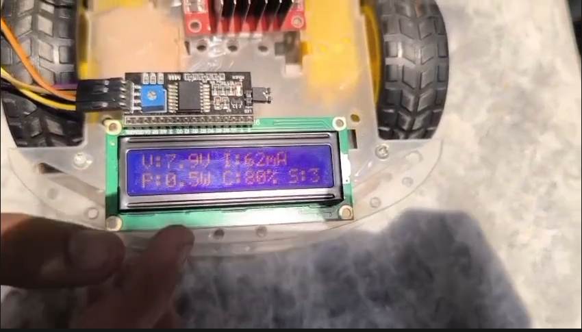
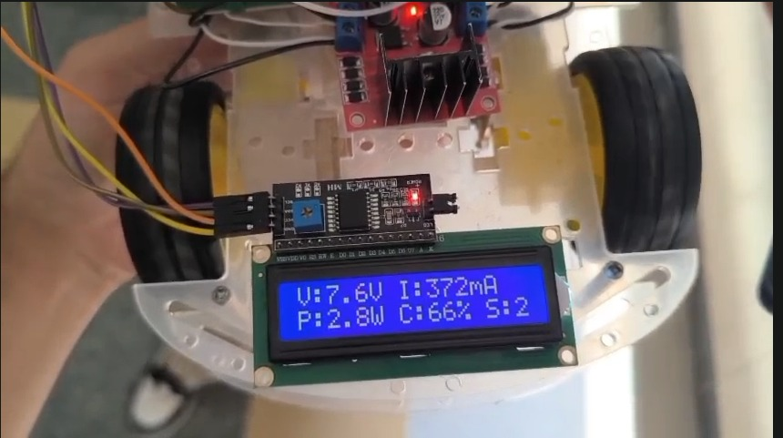

# ☀️ Solar RC Car with Bluetooth Control & Power Monitoring

> A solar-assisted Arduino RC car with real-time power monitoring, Bluetooth wireless control, and live LCD telemetry  
> **Status:** ✅ Complete & Fully Tested


---

## 🎯 Project Overview

A **dual-power RC car** that combines solar energy with Li-ion batteries, controlled wirelessly via the **Dabble app** (Bluetooth gamepad). Every component's voltage, current, and power draw is monitored in **real-time** on a 16x2 I2C LCD display, giving you full telemetry while driving.

### The Challenge
Building a system where:
- ✅ Smooth wireless gamepad control (no jitter)
- ✅ Real-time power monitoring without blocking control
- ✅ Accurate sensor calibration (INA226, voltage dividers)
- ✅ Multi-sensor I2C coordination

**Solution:** Non-blocking async sensor reads + smoothed joystick input + robust error handling

---

## 🚗 System Architecture

```
                    ☀️ SOLAR PANEL
                         ↓
                  [Voltage Divider]
                         ↓
    ┌─────────────────────┼─────────────────────┐
    ↓                     ↓                     ↓
[Arduino Uno]      [INA226 Sensor]      [HC-05 Bluetooth]
    ↓                     ↓                     ↓
  [PWM]          [Voltage/Current/        [Gamepad
  Control         Power Readings]         Input]
    ↓                     ↓                     ↓
[L298N Motor      [16x2 I2C LCD]    [Smooth Joystick
 Driver]          [Live Display]     Input Processing]
    ↓
[4x DC Motors]
(2 Drive + 2 Steering)
    ↑
[2S Li-ion Battery]
```

---

## ⚙️ Components & Specs

| Component | Model/Specs | Purpose | Notes |
|-----------|-------------|---------|-------|
| **Microcontroller** | Arduino Uno | Main control logic | ATmega328P |
| **Bluetooth Module** | HC-05 | Wireless gamepad control | 9600 baud serial |
| **Power Sensor** | INA226 | Voltage, current, power, resistance | I2C address 0x44 |
| **Display** | 16x2 I2C LCD | Real-time telemetry | 20x4 compatible |
| **Motor Driver** | L298N | PWM control for 2 DC motors | Dual H-bridge |
| **Power Source 1** | 2S Li-ion Battery | Main power (7.4V nominal) | 2000mAh typical |
| **Power Source 2** | Solar Panel | Auxiliary charging source | Voltage monitored via divider |
| **Motors** | 4x DC Motors | 2 drive + 2 steering | 6V rated |

---

## 📊 Real-Time Monitoring

The LCD displays **live updates every 500ms**:

```
┌────────────────────┐
│ V:7.2V I:0.5A     │  ← Battery Voltage & Current
│ P:3.6W B:87% S:4.1│  ← Power, Battery %, Solar Voltage
└────────────────────┘
```

**Readable while driving** — non-blocking async reads ensure control responsiveness even during sensor I2C communication.

---

## 🎮 Control Scheme

### Dabble Gamepad Module

```
Joystick Input (angle + radius)
         ↓
   [Smoothing Filter]
   (5-sample rolling avg)
         ↓
   [Direction Mapping]
   (Forward/Back/Left/Right)
         ↓
   [PWM Speed Calculation]
   (Motor speed 80-255)
         ↓
   [L298N Motor Driver]
         ↓
   🚗 Car moves!
```

**Why Smoothing?** Raw Bluetooth joystick data is jittery. A 5-sample rolling average eliminates noise while maintaining responsive feel.

---

## 🔧 Wiring Diagram

**Full pin-by-pin documentation:** See [docs/wiring_connections.md](docs/wiring_connections.md)

### Quick Reference

| Arduino Pin | Component | Purpose |
|------------|-----------|---------|
| D5, D6 | L298N | Motor PWM (IN1, IN2) |
| D9, D10 | L298N | Motor PWM (IN3, IN4) |
| A0 | Voltage Divider | Solar panel voltage |
| A4 (SDA) | INA226 + LCD | I2C data |
| A5 (SCL) | INA226 + LCD | I2C clock |
| RX, TX | HC-05 | Bluetooth serial |

---

## 💻 Code Structure

**Main sketch:** [code/solar_car_final.ino](code/solar_car_final.ino)

### Key Libraries
```cpp
#include <Dabble.h>              // Bluetooth gamepad control
#include <Wire.h>                // I2C communication
#include <LiquidCrystal_I2C.h>   // LCD driver
#include <INA226.h>              // Power sensor driver
```

### Core Functions

| Function | Purpose |
|----------|---------|
| `setup()` | Initialize sensors, motors, Bluetooth |
| `loop()` | Main control loop (non-blocking) |
| `readGamepad()` | Get joystick input from Dabble |
| `smoothJoystick()` | Apply rolling average to raw input |
| `controlMotors()` | Convert angle/radius to motor PWM |
| `updateSensors()` | Read INA226 and voltage divider (async) |
| `displayTelemetry()` | Update LCD with live stats |

---

## 🐛 Debugging Journey

This project required real-world hardware troubleshooting. See [docs/troubleshooting.md](docs/troubleshooting.md) for complete debugging stories:

### Issues Encountered & Resolved

#### ❌ Issue 1: INA226 I2C Address Conflict
**Problem:** Multiple I2C devices (LCD + INA226) fighting for same address  
**Root Cause:** INA226 default address 0x40, but firmware detected at 0x44  
**Solution:** Manually set address in code: `ina226.begin(0x44);`  
✅ **Status:** Fixed

---

#### ❌ Issue 2: Float Display Formatting
**Problem:** INA226 power readings not displaying on LCD  
**Root Cause:** AVR boards (Arduino Uno) don't support `%f` in `sprintf()` by default  
**Solution:** Manually convert float to integer: `int Power = (int)sensor.getPower();`  
✅ **Status:** Fixed

---

#### ❌ Issue 3: Floating Sense Pin
**Problem:** Voltage readings wildly inaccurate (0V one moment, 12V the next)  
**Root Cause:** INA226 sense pin (+) floating without proper connection  
**Solution:** Properly connect shunt resistor sense pins  
✅ **Status:** Fixed

---

#### ✅ Issue 4: Joystick Smoothing
**Improvement:** Raw gamepad input caused jerky steering  
**Solution:** Implemented 5-sample rolling average + clamping  
**Result:** Smooth, predictable control even with noisy Bluetooth data  
✅ **Status:** Complete

---

## 🎬 Demo & Results

### Screenshots

#### Live Stats at Rest


*LCD displaying voltage, current, power, and battery percentage while car is idle*

---

#### Live Stats in Motion


*Real-time monitoring continues during driving — notice current draw increasing with motor activity*

---

### Video Demos

**Car Driving:** [Car_Driving.mp4](images/Car_Driving.mp4)  
*Full demonstration of wireless Dabble gamepad control in action*

**Voltage Monitoring While Working:** [Voltage_Monitoring_While_Working.mp4](images/Voltage_Monitoring_While_Working.mp4)  
*Close-up of LCD telemetry updating in real-time during operation*

---

## 🚀 Getting Started

### Prerequisites
- Arduino Uno with USB cable
- Arduino IDE (1.8.0+)
- Dabble app (iOS/Android)
- HC-05 Bluetooth module already paired

### Setup Steps

1. **Clone or download the repository**
   ```bash
   git clone https://github.com/arhamrizwan2006/Solar-RC-Car.git
   cd Solar-RC-Car
   ```

2. **Install required Arduino libraries**
   - Dabble
   - LiquidCrystal_I2C
   - INA226

   *Sketch → Include Library → Manage Libraries → search and install*

3. **Open the sketch**
   ```
   code/solar_car_final.ino
   ```

4. **Review wiring**
   - Check [docs/wiring_connections.md](docs/wiring_connections.md)
   - Match your board to the pin assignments

5. **Upload to Arduino**
   - Select Board: Arduino Uno
   - Select COM port
   - Click Upload

6. **Pair Bluetooth**
   - Open Dabble app
   - Connect to HC-05
   - Select Gamepad module

7. **Test & Drive!**
   - Verify LCD displays readings
   - Check motor response
   - Monitor power consumption

---

## 💡 Key Learnings

✅ **I2C Protocol & Troubleshooting**
- Understanding address conflicts
- Debugging sensor communication issues
- Multi-device I2C coordination

✅ **Real-Time Sensor Data Processing**
- Non-blocking async reads
- Handling float precision on AVR boards
- Sensor calibration & validation

✅ **Wireless Control & Input Smoothing**
- Bluetooth serial communication
- Gamepad mapping (angle/radius → motor commands)
- Digital filtering for noisy inputs

✅ **Power Electronics**
- Voltage divider design for safe ADC reading
- Battery percentage estimation
- Power monitoring with shunt resistors

✅ **Hardware Debugging**
- Oscilloscope analysis (if available)
- Serial monitor logging
- Iterative testing & validation

---

## 🔮 Future Enhancements

🎯 **Phase 2 Ideas:**
- Add GPS module for autonomous navigation
- Implement obstacle avoidance (HC-SR04 ultrasonic)
- Improve solar charging with dedicated MPPT controller
- Log power consumption over time (SD card storage)
- Add line-following mode (IR sensors)
- Mobile app integration for advanced telemetry

---

## 📂 Repository Structure

```
Solar-RC-Car/
├── code/
│   └── solar_car_final.ino         (Main Arduino sketch)
├── docs/
│   ├── wiring_connections.md       (Pin-by-pin connections)
│   └── troubleshooting.md          (Debugging guide)
├── images/
│   ├── Car_Driving.mp4             (Demo video)
│   ├── Stats_Monitoring_at_Rest.png
│   ├── Stats_Monitoring_in_Motion.png
│   └── Voltage_Monitoring_While_Working.mp4
├── LICENSE                         (MIT)
└── README.md                       (This file)
```

---

## 🔗 Resources & References

- 📚 [Arduino Official Documentation](https://docs.arduino.cc/)
- 🎮 [Dabble App Documentation](https://thestempedia.com/docs/dabble/introduction/)
- 📖 [INA226 Datasheet](https://ti.com/)
- 🔌 [HC-05 Bluetooth Module](https://www.electronicwings.com/arduino/hc-05-bluetooth-module)
- ⚡ [L298N Motor Driver](https://components101.com/motor-drivers/l298n-dc-motor-driver-ic)

---

## ✨ Highlights

- 🌍 **Dual-Power Architecture** — Solar + Battery for extended range
- 📡 **Wireless Control** — Low-latency Bluetooth gamepad from Dabble app
- 📊 **Real-Time Telemetry** — Complete power consumption visibility
- 🔧 **Battle-Tested Code** — Multiple hardware issues debugged and resolved
- 📝 **Well-Documented** — Wiring diagrams, troubleshooting, and inline comments

---

**Project Status:** ✅ **Complete & Field-Tested**  
**Last Updated:** 2026-07-30  
**Author:** Muhammad Arham Rizwan  
**License:** MIT

*Building the future of autonomous systems, one motor at a time.* ⚡🚗
